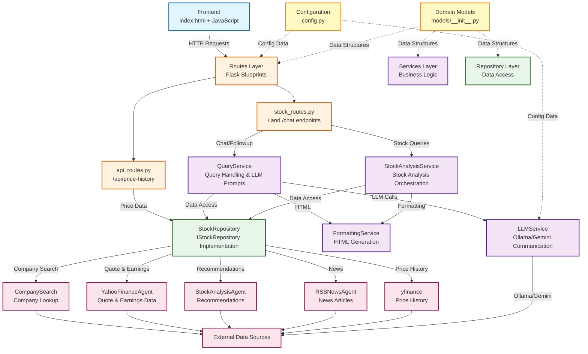

# Stock Market Agent - Architecture

## System Overview

This document describes the refactored backend architecture following clean layered design principles.

## Architecture Diagram



## Layer Descriptions

### 1. **Frontend Layer** (`index.html`)
- User interface with Chat.js integration
- Stock search with fuzzy matching for indices
- Interactive price charts with Chart.js
- Handles user input and displays responses

### 2. **Routes Layer** (`web/routes/`)
- **stock_routes.py**: Main page (`/`) and chat endpoint (`/chat`)
- **api_routes.py**: RESTful API for price history (`/api/price-history`)
- Uses Flask blueprints for modularity
- Minimal logic - delegates to service layer

### 3. **Services Layer** (`web/services/`)
- **QueryService**: Handles different query types
  - Stock queries (initial analysis)
  - Follow-up queries (with contradiction detection)
  - Earnings queries
  - News article summarization
  - Multi-stock comparisons
  
- **StockAnalysisService**: Orchestrates stock analysis
  - Ticker detection and validation
  - Company search fallback
  - Analysis aggregation
  
- **LLMService**: LLM communication
  - Ollama and Gemini provider support
  - Prompt generation
  - Response humanization
  
- **FormattingService**: HTML generation
  - Analysis formatting with tooltips
  - Earnings tables
  - Recommendation heatmaps
  - Expandable sections

### 4. **Repository Layer** (`web/repositories/`)
- **StockRepository**: Data access abstraction
  - Implements `IStockRepository` interface
  - Company search
  - Ticker validation
  - Quote fetching
  - Recommendations
  - News retrieval
  - Price history
  - Earnings data
  - Stock info

### 5. **Configuration** (`web/config.py`)
- Centralized configuration management
- Environment variable loading
- LLM provider settings
- Model mappings
- Timeout and cache settings

### 6. **Domain Models** (`web/models/`)
- Data structures for:
  - StockQuote
  - StockRecommendations
  - NewsArticle
  - PriceHistory
  - CompanyMatch
  - StockAnalysis
- Includes `to_dict()` methods for serialization

### 7. **External Data Sources**
- **CompanySearch**: Company name to ticker resolution
- **YahooFinanceAgent**: Real-time quotes and earnings
- **StockAnalysisAgent**: Technical & fundamental recommendations
- **RSSNewsAgent**: Latest stock news
- **yfinance**: Historical price data

## Key Design Patterns

### Dependency Injection
```python
# Service initialization in app.py
stock_service = StockAnalysisService(
    repository=repository,
    formatter=formatting_service
)
```

### Repository Pattern
```python
# Abstract interface
class IStockRepository(ABC):
    @abstractmethod
    def get_quote(self, ticker: str) -> Dict: ...
```

### Application Factory
```python
def create_app(config_object=None):
    app = Flask(__name__)
    # ... configuration and setup
    return app
```

### Blueprint Registration
```python
stock_bp = init_stock_routes(stock_service, query_service)
app.register_blueprint(stock_bp)
```

## Data Flow Example: Stock Query

1. **User** enters "AAPL" in frontend
2. **Frontend** sends POST to `/chat`
3. **stock_routes.py** receives request → calls `StockAnalysisService.find_ticker()`
4. **StockAnalysisService** validates ticker → calls `StockRepository.get_quote()`
5. **StockRepository** calls `YahooFinanceAgent` → returns quote data
6. **StockAnalysisService** aggregates data from multiple agents
7. **FormattingService** generates HTML with tooltips and charts
8. **stock_routes.py** stores context in session → returns JSON response
9. **Frontend** displays formatted analysis

## Benefits of Refactored Architecture

### Maintainability
- Each layer has a single responsibility
- Changes isolated to specific modules
- Clear boundaries between components

### Testability
- Services can be tested with mocked repositories
- Repository can be tested with mocked external APIs
- Routes can be tested with mocked services

### Scalability
- Easy to add new data sources (implement `IStockRepository`)
- Easy to add new LLM providers (extend `LLMService`)
- Easy to add new endpoints (create new blueprints)

### Reusability
- Services can be used across different routes
- Repository abstracts data access
- Formatting logic centralized

## File Structure

```
web/
├── app.py                          # Application factory & main entry
├── config.py                       # Configuration management
├── index.html                      # Frontend UI
├── models/
│   └── __init__.py                # Domain models
├── repositories/
│   ├── __init__.py
│   └── stock_repository.py        # IStockRepository + StockRepository
├── routes/
│   ├── __init__.py
│   ├── api_routes.py              # API endpoints
│   └── stock_routes.py            # Stock & chat endpoints
└── services/
    ├── __init__.py
    ├── formatting_service.py      # HTML generation
    ├── llm_service.py             # LLM communication
    ├── query_service.py           # Query handling
    └── stock_service.py           # Stock analysis orchestration
```

## Migration from Monolithic Architecture

**Before**: 996-line `app.py` with mixed concerns
- Configuration, models, formatting, business logic, data access, and routes all in one file
- Difficult to test individual components
- Hard to extend or modify

**After**: Layered architecture with separation of concerns
- **63-line** `app.py` (application factory)
- Clear module boundaries
- Easy to test each layer independently
- Simple to extend with new features

## Running the Application

```bash
cd web
python app.py
```

Server starts at `http://127.0.0.1:5001`

## Environment Variables

```bash
# LLM Configuration
export LLM_PROVIDER=ollama          # or 'gemini'
export OLLAMA_URL=http://localhost:11434/api/chat
export GEMINI_API_KEY=your_key_here  # if using Gemini

# Flask Configuration
export SECRET_KEY=your_secret_key
```
